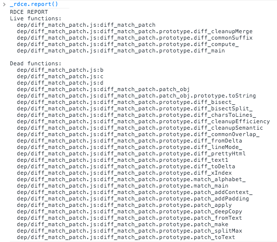

# Rdce

A tool for analyzing JavaScript code to identify live and dead code paths at runtime. Rdce should run in any modern JavaScript environment. It works by post-processing JavaScript files to inject small hooks at the beginning of function bodies. These hooks, in combination with a small runtime library, allow it to track execution of functions to easily identify live and dead ones.

### Example

The example below was generated via the following steps:

```bash
rdce dep/diff_match_patch.js > dep/diff_match_patch.rdce.js
rdce -r > dep/rdce.js
```

Then the testing HTML document was updated like:

```html
<!-- Plain version: <script type="text/javascript" src="dep/diff_match_patch.js"></script> -->
<!-- Rdce version: -->
<script type="text/javascript" src="test/rdce.js"></script>
<script type="text/javascript" src="dep/diff_match_patch.rdce.js"></script>
```

The testing application was then run through its regular usage paces. Finally, `_rdce.report()` was called in the console:



### License

Released under the MIT license, see `LICENSE` for details.
